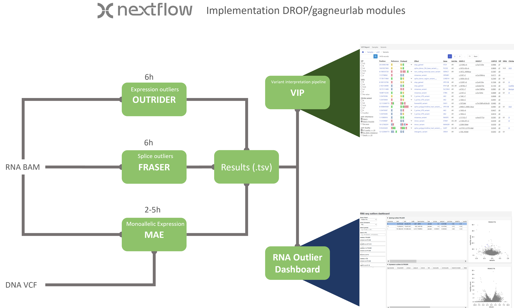

# RNA outlier detection workflow

## Info
This project is developed during an internship at the Systems Genetics departement UMC Groningen. Please be aware that it is still in development and may lack certain features or contain nasty bugs. 

## Project overview

This pipeline written in Nextflow will yield outlier results for gene expression and splicing. It consists of several modules of the `DROP pipeline` the `OUTRIDER`, `FRASER` and `Mono-allelic-expression` modules (gagneur-lab) and is made to be compatible for integration in genomic variant interpration workflows.

Input for the pipeline is an annotation file with paths to the BAM files and several processing options. External counts are/can be added to improve gene/splice outlier significance.
For more information and a how-to see [Pipeline](pipeline.md).

For the interpretation of the pipeline results an interactive dashboard is in development.
for details and an example see [Dashboard](dashboard.md).

